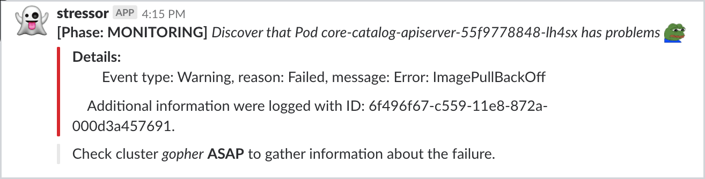

# Service Catalog Tester

## Overview

This project contains reproducible test-cases for service-catalog.

## Prerequisites

To set up the project, use these tools:
* Version 1.9 or higher of [Go](https://golang.org/dl/)
* The latest version of [Docker](https://www.docker.com/)
* The latest version of [Dep](https://github.com/golang/dep)

## Usage

This section explains how to use the Etcd Backup tool.

### Use environment variables
Use the following environment variables to configure the application:

| Name | Required | Default | Description |
|-----|---------|--------|------------|
|**APP_PORT** | NO | `8080` | The port on which the HTTP server listens |
| **APP_LOGGER_LEVEL** | No | `info` | Show detailed logs in the application. |
| **APP_KUBECONFIG_PATH** | No |  | The path to the `kubeconfig` file that you need to run an application outside of the cluster. |
| **APP_SLACK_CLIENT_CHANNEL_ID** | Yes |  | The Slack channel where notification are posted. |
| **APP_SLACK_CLIENT_WEBHOOK_URL** | Yes |  | The Slack Webhook URL. |
| **APP_SLACK_CLIENT_TOKEN** | Yes |  | The Slack token used as the key to messages on Slack channel. |
| **APP_OBSERVABLE_NAMESPACE** | Yes |  | The name of the Namespace where observed Deployments are installed. |
| **APP_OBSERVABLE_DEPLOYMENTS_NAMES** | Yes |  | The names of Deployment which need to observed. Multiple Deployments names should be separated by comma. |
| **APP_CLUSTER_NAME** | Yes |  | The name of the Kubernetes cluster where the tests are executed. |

### Install on cluster

You can install the Service Catalog Tester on your cluster by installing the Helm Chart.

```bash
 helm install --name stressor --namespace kyma-system deploy/stressor \
 --set slackClient.webhookUrl={url} \
 --set slackClient.channelId={channel_id} \
 --set slackClient.token={token} \
 --set observable.namespace={namespace} \
 --set clusterName={cluster_name}
```

### Get more info about reported issues

When the problem occur on cluster then notification is send to the Slack channel.

Example:



To get more information about the problem, you need to get logs from the Service Catalog Tester application and filter it by the notification **ID**.

Example:
```
kubectl logs -l app=stressor | grep '"ID":"6f496f67-c559-11e8-872a-000d3a457691"'
```

## Development

### Add new test

New test need to be added under the `internal/tests` directory and implements such interface

```go
	// Test allows to execute test in a generic way
	Test interface {
		Execute(stop <-chan struct{}) error
		Name() string
	}
```

Thanks to that it can be easily executed in `main.go` just by adding such statement

```
go testRunner.Run(stopCh, cfg.Throttle, {test_instance})
```

### Run tests

To run all unit tests, execute the following command:

```bash
go test ./...
```

### Verify the code

To check if the code is correct and you can push it, run the `before-commit.sh` script. It builds the application, runs tests, checks the status of the vendored libraries, runs the static code analysis, and ensures that the formatting of the code is correct.

### Build a production version

First you need to login into Google Container Registry
```
gcloud auth configure-docker
```
Then to build and push the Docker image, run this commands:

```bash
docker build service-catalog-tester:{image_tag}
docker tag service-catalog-tester:{image_tag} eu.gcr.io/kyma-project/develop/service-catalog-tester:{image_tag}
```

The variables are:

* `{image_tag}` - tag of the output image. To check the newest tag, go to: https://console.cloud.google.com/gcr/images/kyma-project/EU/develop/service-catalog-tester
