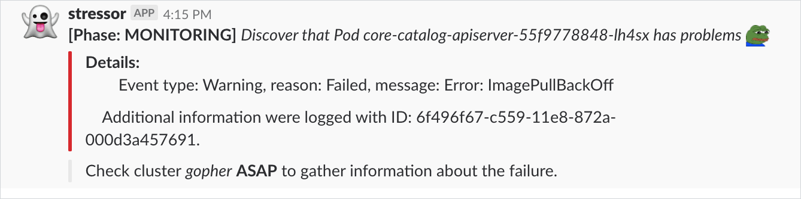

# Service Catalog Tester

## Overview

This project contains reproducible test cases for the Service Catalog.

## Prerequisites

To set up the project, use these tools:
* Version 1.9 or higher of [Go](https://golang.org/dl/)
* The latest version of [Docker](https://www.docker.com/)
* The latest version of [Dep](https://github.com/golang/dep)

## Usage

This section explains how to use the Service Catalog Tester tool.

### Use environment variables
Use the following environment variables to configure the application:

| Name | Required | Default | Description |
|-----|---------|--------|------------|
| **APP_PORT** | NO | `8080` | The port on which the HTTP server listens. |
| **APP_LOGGER_LEVEL** | No | `info` | Show detailed logs in the application. |
| **APP_KUBECONFIG_PATH** | No |  | The path to the `kubeconfig` file needed to run an application outside the cluster. |
| **APP_SLACK_CLIENT_CHANNEL_ID** | Yes |  | The Slack channel where notification are posted. |
| **APP_SLACK_CLIENT_WEBHOOK_URL** | Yes |  | The Slack Webhook URL. |
| **APP_SLACK_CLIENT_TOKEN** | Yes |  | The Slack token used as the key to messages on Slack channel. |
| **APP_OBSERVABLE_DEPLOYMENTS_NAMESPACE** | Yes |  | The name of the Namespace where observed Deployments are installed. |
| **APP_OBSERVABLE_DEPLOYMENTS_NAMES** | Yes |  | The names of Deployments you want to observe. Multiple Deployments names should be separated by comma. |
| **APP_CLUSTER_NAME** | Yes |  | The name of the Kubernetes cluster where the tests are executed. |
| **APP_E2E_SERVICE_CATALOG_HAPPY_PATH_TEST_ONLY_SERVICE_CATALOG** | No | false | If set to `false`, the testing scenario also covers injecting ServiceBinding Secrets to the sample application. |
| **APP_E2E_SERVICE_CATALOG_HAPPY_PATH_TEST_THROTTLE** | No | 60s | Defines the time after which the next test is executed. |

### Install on the cluster

You can install the Service Catalog Tester on your cluster by installing the Helm Chart.

```bash
 helm install --name stressor --namespace kyma-system deploy/stressor \
 --set slackClient.webhookUrl={url} \
 --set slackClient.channelId={channel_id} \
 --set slackClient.token={token} \
 --set observableDeployments.namespace={namespace} \
 --set e2eServiceCatalogHappyPath.testThrottle={namespace} \
 --set clusterName={cluster_name}
```

### Get more information about reported issues

When the problem occurs on the cluster, a notification is sent to the Slack channel:



To get more information about the problem, get logs from the Service Catalog Tester application and filter them by the notification **ID**.

For example:
```
kubectl logs -l app=stressor | grep '"ID":"6f496f67-c559-11e8-872a-000d3a457691"'
```

## Development

This section presents how to add and run a new test. It also describes how to verify the code and build the production version.

### Add a new test

Add a new test under the `internal/tests` directory and implement the following interface:

```go
	Test interface {
		Execute(stop <-chan struct{}) error
		Name() string
	}
```

This allows you to easily run the test in the `main.go` file by adding the following statement:

```
go testRunner.Run(stopCh, {throttle}, {test_instance})
```

### Run tests

To run all unit tests, execute the following command:

```bash
go test ./...
```

### Verify the code

To check if the code is correct and you can push it, run the `before-commit.sh` script. It builds the application, runs tests, checks the status of the vendored libraries, runs the static code analysis, and ensures that the formatting of the code is correct.

### Build a production version

To build a production version, follow these steps:

1. Sign in to Google Container Registry.
```
gcloud auth configure-docker
```

2. Build and push the Docker image by running these commands:
```bash
docker build service-catalog-tester:{image_tag}
docker tag service-catalog-tester:{image_tag} eu.gcr.io/kyma-project/develop/service-catalog-tester:{image_tag}
```

The `{image_tag}` variable specifies a tag of the output image. To check the newest tag, go [here](https://console.cloud.google.com/gcr/images/kyma-project/EU/develop/service-catalog-tester).