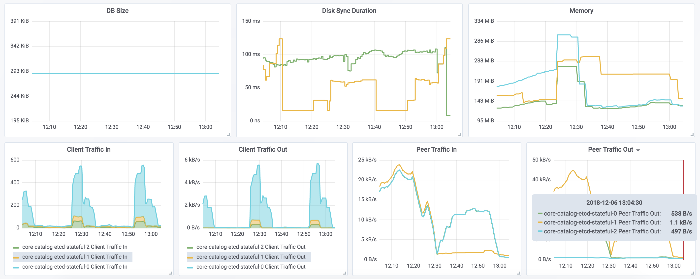

# Stress-etcd

Stress-etcd is a tool that populates keys in the etcd database. You can use it
to evaluate the performance of an etcd cluster.

>**NOTE:** Naming convention of the etcd cluster changed in Kyma version 0.5.0.
Pods name changed from `core-catalog-etcd-stateful-X` to `service-catalog-etcd-stateful-X`. If you need
to test the older version, modify the content of the `get-ssl-files.sh` script and the port-forward command.

## Usage

Follow these steps to run the test:
1. Run the `build.sh` script to create a new Docker image named `stress-etcd`.

2. Establish a connection to the etcd cluster.
   
   To connect to the etcd instance running on Kubernetes cluster, forward a port from 
   one of the etcd instances. Run this command to open the `2379` port on localhost:    
   ```bash
   kubectl -n kyma-system port-forward service-catalog-etcd-stateful-0 2379:2379
   ```
3. Download certificates using the `get-ssl-files.sh` script. It creates the `ssl` subdirectory that contains `etcd-client.crt`, `etcd-client.key`, and `etcd-client-ca.crt` files. 

4. Run `run-test.sh` to trigger the test with default settings. It spawns the container, mounts the `ssl` directory, and provides the following parameters:
   * **ETCD_SERVER**, which is the address of the server (default: `host.docker.internal:2379`).
   * **KEY_COUNT**, which is the number of keys to populate (default: `100`).
   * **KEY_SIZE**, which is the size of each key in bytes (default: `1000`).

### Examples

The following information appears when you run the test:

```bash
$ ./run-test.sh
ETCD version:
{"etcdserver":"3.3.9","etcdcluster":"3.3.0"}
Starting test
#	#ip:port        	time_total	size_upload
1       192.168.65.2:2379	0.300764	2676
2       192.168.65.2:2379	0.246349	2676
3       192.168.65.2:2379	0.774941	2676
4       192.168.65.2:2379	0.370848	2676
5       192.168.65.2:2379	0.293486	2676
Updated 5 keys of 5

real	0m5.381s
user	0m0.032s
sys	0m0.017s
``` 

If you want to test multiple workers at the same time, 
spin up several instances of the `run-test.sh` script.

When running the test, you can observe the load on the etcd cluster:



The graphs show the load on the cluster in the following configuration:
- three etcd Nodes, ram=512MB, snapshot-count=10000
- two stress-etcd workers, key_size=2000


